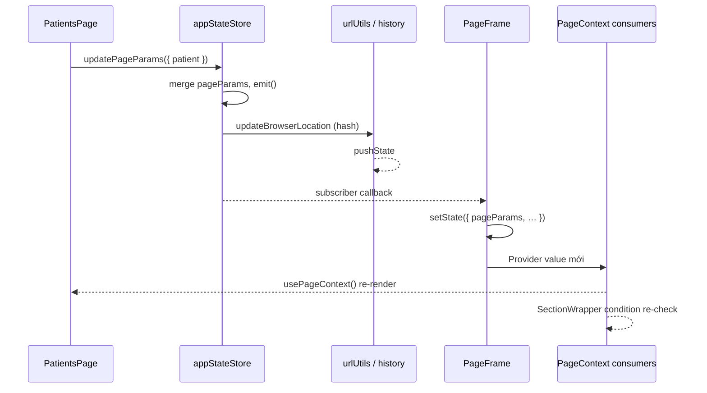
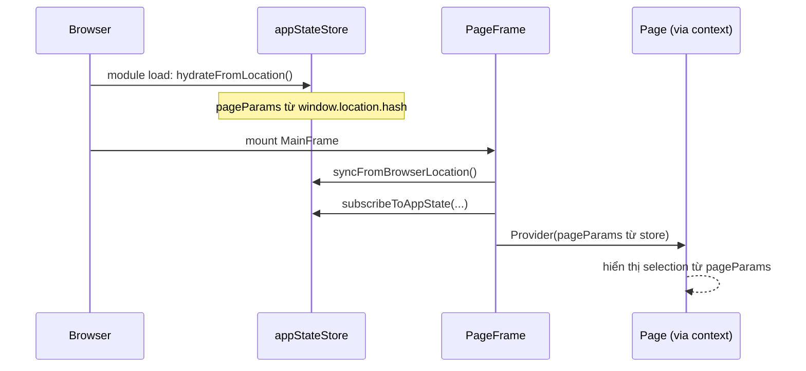

# Luồng kết nối: `appStateStore` ↔ pages

Doc này chỉ ra **điểm nối** để API trong `frame-common/src/frame-layout/stores/appStateStore.ts` tương tác được với các page trong app.

Chi tiết API / URL: [`app-state.md`](./app-state.md). Layout primitives: [`frame-layout.md`](./frame-layout.md).

## Kết luận ngắn

Store **không** biết React. Page **không** tự subscribe store.

**`PageFrame`** là cầu nối duy nhất: subscribe store → đẩy snapshot vào `PageContext` → page / layout đọc qua `usePageContext()`. Ghi luôn gọi thẳng store (`updatePageParams`, …).

Không có `PageFrame` ở route cha → ghi URL vẫn chạy được, nhưng UI page **không** re-render theo state / `condition` layout không đọc được `pageParams`.

## Sơ đồ tổng quan

```
┌─────────────────────────────────────────────────────────────────┐
│  App (project/)                                                 │
│                                                                 │
│  Router                                                         │
│    └─ MainFrame extends PageFrame          ◄── điểm nối React │
│          │                                                      │
│          ├─ PageContext.Provider                                │
│          │     pageParams / pageSearch / moduleState            │
│          │                                                      │
│          └─ <Outlet />                                          │
│                └─ PatientsPage / HomePage / …                   │
│                      ├─ GHI: updatePageParams(...)  ──┐         │
│                      └─ ĐỌC: usePageContext()         │         │
└───────────────────────────────────────────────────────┼─────────┘
                                                        │
┌───────────────────────────────────────────────────────▼─────────┐
│  frame-common                                                   │
│                                                                 │
│  appStateStore.ts                                               │
│    updatePageParams / updateModuleState / …                     │
│         │                                                       │
│         ├─ emit → subscribers (PageFrame)                       │
│         └─ (nếu pageParams|pageSearch)                          │
│               urlUtils.updateBrowserLocation → window.history   │
│                                                                 │
│  PageFrame                                                      │
│    subscribeToAppState → setState → Provider value mới          │
│    popstate/hashchange → syncFromBrowserLocation                │
│                                                                 │
│  SectionWrapper (trong layout)                                  │
│    usePageContext().matchPageParams(condition)                  │
└─────────────────────────────────────────────────────────────────┘
```

## Chuỗi file (ai làm gì)

| Lớp | File | Vai trò |
|-----|------|---------|
| Store | `frame-layout/stores/appStateStore.ts` | Giữ state, mutation API, `emit` listeners |
| URL | `frame-layout/utils/urlUtils.ts` | `pageParams` ↔ hash, `pageSearch` ↔ query |
| Bridge | `frame-layout/components/PageFrame.tsx` | Subscribe store + browser nav → `PageContext` |
| Context | `frame-layout/contexts.tsx` | Kiểu snapshot đọc + `usePageContext` |
| Layout | `layouts/*` + `SectionWrapper` | Đọc `pageParams` cho `condition` |
| App chrome | `project/src/frame.tsx` (`MainFrame`) | Subclass `PageFrame`, bọc `<Outlet />` |
| Page | `project/src/pages/*` | Ghi store + đọc context |

## Luồng 1 — Page ghi state (ví dụ chọn patient)



1. Page import `updatePageParams` từ `frame-common` (không qua context).
2. Store merge + `emit`.
3. Nếu đổi `pageParams` / `pageSearch` → cập nhật URL.
4. `PageFrame` (đã `subscribeToAppState` trong `componentDidMount`) nhận notify → `setState`.
5. `render()` tạo `createPageContextValue(...)` mới → mọi `usePageContext()` / layout con re-render.

## Luồng 2 — Reload / mở URL có hash



- Hydrate lần đầu khi load module store.
- `PageFrame` mount gọi lại `syncFromBrowserLocation` (HMR / timing an toàn).
- Page **không** cần parse URL — chỉ đọc `usePageContext().pageParams`.

## Luồng 3 — Back / Forward

```
popstate | hashchange
    → PageFrame.onBrowserNavigation
    → syncFromBrowserLocation()   // syncUrl: false (không pushState lại)
    → emit
    → PageFrame setState
    → context / pages cập nhật
```

## Luồng 4 — `updateModuleState` (không đụng URL)

Giống luồng 1 nhưng **bỏ** bước `updateBrowserLocation`.

- Store vẫn `emit` → `PageFrame` vẫn đẩy `moduleState` vào context.
- Reload mất (đúng thiết kế). Dùng cho sort, refreshTrigger, panel tạm, …

## Điều kiện bắt buộc trong app

```tsx
// project/src/frame.tsx
class MainFrameInner extends PageFrame {
  renderContent() {
    return (
      <div className="app-frame">
        <header>…</header>
        <div className="app-frame__body">
          <Outlet />   {/* pages phải nằm đây */}
        </div>
      </div>
    )
  }
}
```

```tsx
// routes: page là child của MainFrame
{ path: 'app', element: <MainFrame />, children: [
  { path: 'patients', element: <PatientsPage /> },
]}
```

Checklist:

- [ ] Route page **nằm trong** tree của `PageFrame` (ví dụ `MainFrame`)
- [ ] Ghi bằng store API (`updatePageParams` / `updateModuleState`)
- [ ] Đọc UI bằng `usePageContext()` (hoặc `getAppState()` nếu imperative)
- [ ] `frame-common`: `project` alias vào `src` (build `dist` chỉ khi check / không alias)

## Điểm nối trong `PageFrame` (tham chiếu code)

| Hook / method | Việc |
|---------------|------|
| `constructor` | `getAppState()` → state ban đầu |
| `componentDidMount` | `syncFromBrowserLocation`, `subscribeToAppState`, lắng nghe `popstate`/`hashchange` |
| subscriber callback | `setState({ pageParams, pageSearch, moduleState })` |
| `render` | `createPageContextValue` → `PageContext.Provider` |
| `componentWillUnmount` | unsubscribe + remove listeners |

Mutation **không** đi qua `PageFrame` — page gọi thẳng `appStateStore`; `PageFrame` chỉ phản ứng sau `emit`.

## Liên quan

- [`app-state.md`](./app-state.md) — API, hash format, khi nào dùng `moduleState`
- [`frame-layout.md`](./frame-layout.md) — `PageFrame` / layout / `condition`
- [`frame-common.md`](./frame-common.md) — build & import lib
